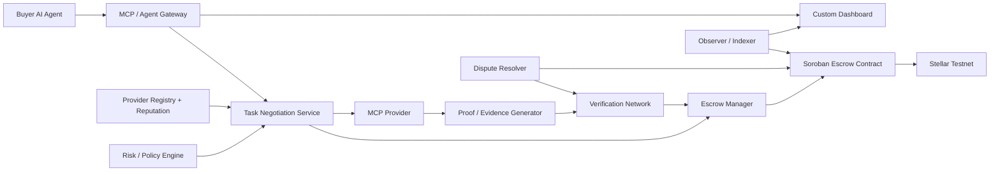

# System Architecture

## Logical architecture

## Responsibility boundaries
### Buyer agent
Chooses a provider, submits task requirements, receives result, and may dispute. It never directly releases escrow.

### MCP / Agent Gateway
Adapts agent tool calls and provider metadata into VAEP protocol messages. MCP is a service interaction layer; VAEP remains the settlement/verification layer.

### Task Negotiation Service
Creates canonical task objects, validates quotes, computes commitments, and tracks off-chain workflow state.

### Escrow Manager
Builds and submits Soroban transactions, tracks contract state, and exposes a normalized API to the frontend.

### Soroban Escrow Contract
Authoritative financial state machine. It owns escrowed funds and controls release/refund according to on-chain rules and accepted verification decisions.

### Verification Network
Evaluates evidence under a declared policy. A policy can be deterministic, signature-based, multi-verifier, oracle-based, challenge-window based, or a composition.

### Registry/Reputation
Maintains provider capabilities and historical performance. Reputation is advisory unless a specific policy explicitly uses it.

### Dashboard
Visualization and operator tooling only. It cannot override contract state.

## Trust boundaries
1. AI-generated content is untrusted.
2. Provider outputs are untrusted until verified.
3. Frontend input is untrusted.
4. External oracle input is untrusted.
5. The Soroban contract is the financial trust boundary.

## Core invariant
`Escrowed funds may leave the contract only through a valid terminal settlement transition.`
